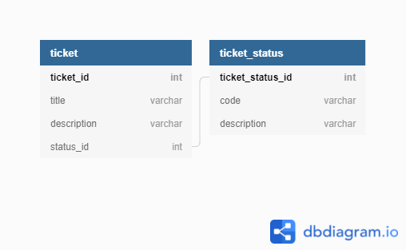

Here you can find application's DB schema written in DBML. Here's a picture:  
  
You can view it on [dbdiagram.io](https://dbdiagram.io/d/62378dd5bed6183873c7f3d8) too, but it may be different as it's work in progress.